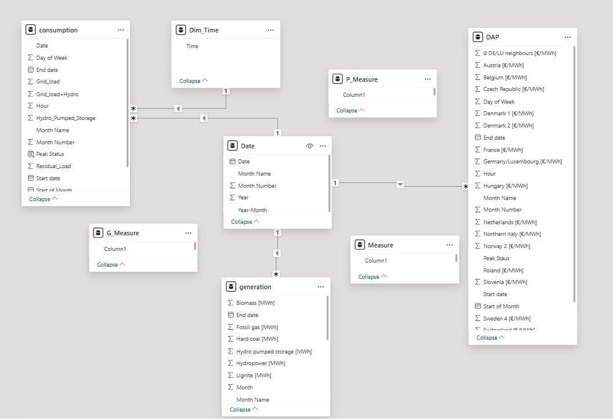
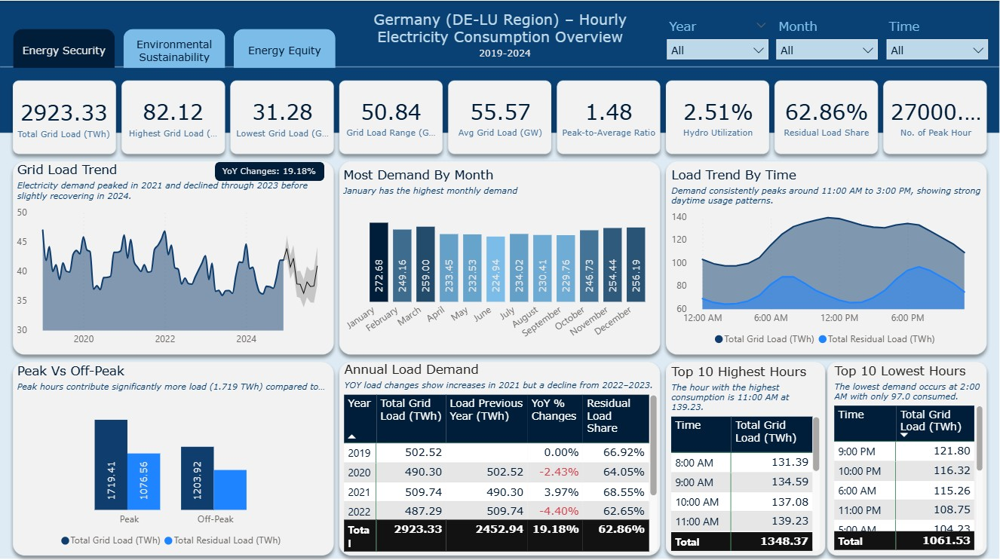
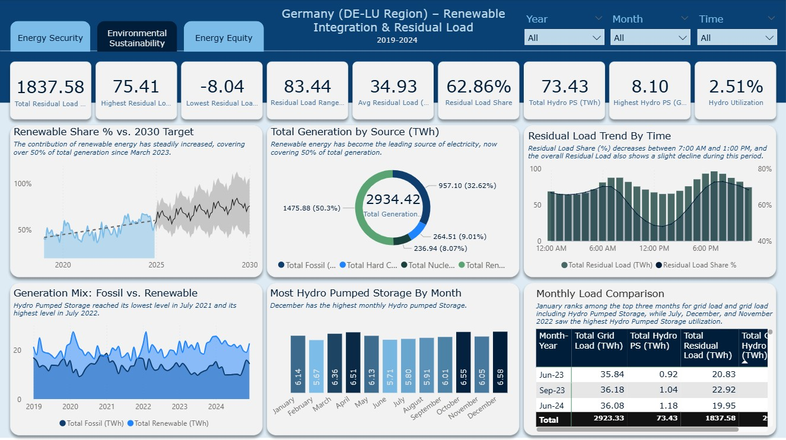
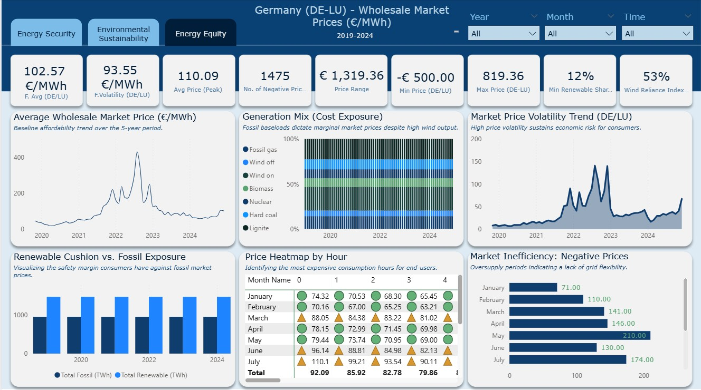

# Supporting Energy Policy Decisions Using Business Intelligence
**Master’s Thesis Project: A Decision Support System for Germany’s Energiewende**

## 1. Project Overview
This repository showcases a Business Intelligence (BI) solution developed to monitor and analyze energy data. The project integrates fragmented federal data into a unified Power BI dashboard to support proactive policy adjustments and mitigate **Bounded Rationality** in decision-making.

## 2. Technical Stack
*   **Visualization & ETL:** Microsoft Power BI (Power Query / M-code)
*   **Data Modeling:** Relational Star Schema
*   **Predictive Analytics:** ETS (Error, Trend, Seasonality) Forecasting / Holt-Winters Seasonal Method
*   **Statistical Validation:** IBM SPSS Statistics (Non-parametric testing)
*   **Data Sourcing:** [SMARD.de](https://www.smard.de) (Federal Network Agency / BNetzA)

## 3. ETL & Data Engineering
*   **Extraction:** Automated ingestion of 24 multi-year CSV datasets (2019–2024).
*   **Transformation:** Used M-code to standardize headers (e.g., mapping `grid load [MWh]` to `Grid_Load`) and handle German-to-International decimal formats.
*   **Data Enrichment:** Engineered a **Peak Status** calculated column to segment high-stress grid hours (08:00–20:00).
*   **Harmonization:** Maintained statistical integrity by utilizing synchronized hourly temporal resolutions across all primary datasets (Generation, Consumption, and Market Prices), naturally preventing resolution mismatches during visualization."

## 4. Data Model Architecture
*   **Schema:** Implemented a **Star Schema** for high-performance filtering of millions of rows.
*   **Relationships:** Linked Fact Tables (Consumption, Generation, Prices) to a central **Master Date Dimension** via One-to-Many (1:N) relationships.
*   **DAX Measures:** Developed custom calculations for KPIs to decouple logic from the visual layer:
    *   `Residual Load Share %`
    *   `Peak Fossil Share %`
  
*Figure 1: Relational Star Schema linking Fact Tables to a Central Date Dimension.*

## 5. Key Strategic Insights
*   **Energy Security:** Identified the **"Duck Curve"** effect and the 6:00 PM "Maximum Risk Hour" where solar generation vanishes while demand remains high.
*   **Sustainability Gap:** Forecasted a **25% to 30% gap** between current trajectories and the 80% statutory renewable mandate for 2030.
*   **Economic Impact:** Visualized the **Merit Order Effect**, demonstrating how renewable peaks displace expensive fossil fuel sources to lower wholesale market prices.

  
*Figure 2: Energy Security Overview – Monitoring grid load trends, peak vs. off-peak consumption, and hourly demand patterns.*

---

  
*Figure 3: Environmental Sustainability – Visualizing the "Duck Curve," residual load trends, and the projected gap toward the 2030 renewable targets.*

---

  
*Figure 4: Energy Equity – Analyzing wholesale market prices (€/MWh), the Merit Order Effect, and the occurrence of negative price periods.*

## 6. Impact & Validation
*   **Efficiency:** Expert surveys indicated a time savings of **1 to 4 hours per week** for 85.7% of participants.
*   **Decision Support:** 100% consensus (Median = 4.0) among experts that the tool reduced **cognitive load** when assessing complex Energy Trilemma trade-offs.

---
*Developed as part of a Master’s Thesis on Data-Driven Policy Making.*
